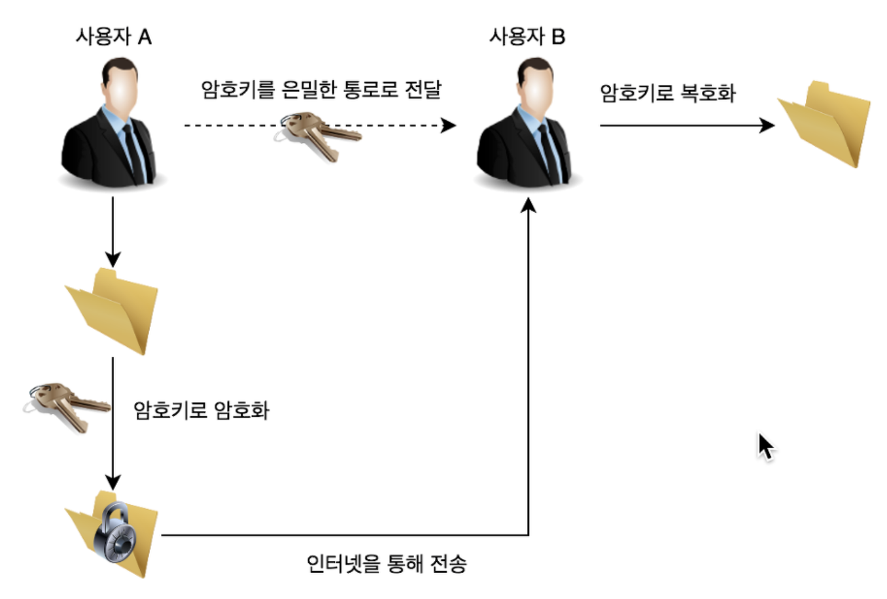
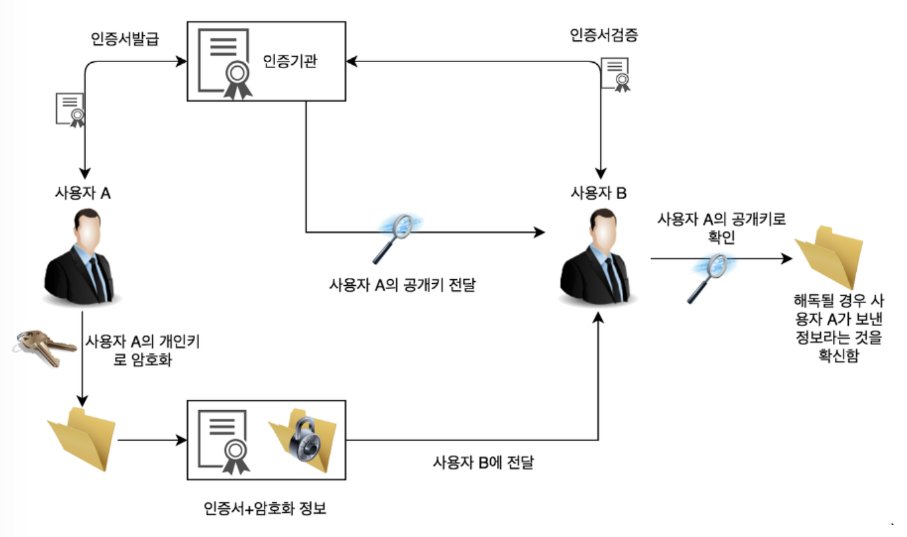

## **대칭키(Symmetric Key)**

> 암호화와 복호화에 같은 암호키(대칭키)를 사용하는 알고리즘
>


- 동일한 키를 주고받기 때문에, 매우 빠르다는 장점이 있음
- 대칭키 암호 방식으로 암호화한 정보를 누군가에게 보낼 때, **암호키도 함께** 보내야 한다.
    - 암호키 자체는 암호화가 되지 않은 평문으로 분실하거나 타인에게 노출되면 보안에 매우 취약할 수 있다.
- **키 전달 및 관리에 어려움이 있지만, 대칭키 암호화 방식은 암호화 연산 속도가 빠르기 때문에 효율적인 암호 시스템을 구축할 수 있다는 장점이 있다.**
- 블록 암호화, 스트림 암호화가 있다.
- 기**밀성을 제공**하나, **무결성/인증/부인방지 를 보장하지 않는다.**
- 대표적으로는 DES, 3DES, AES, SEED, ARIA 가 있다.

### 단점

- 키를 교환하는 과정에 키가 탈취될 수 있다.
- 사람이 증가할 수록 따로따로 키 교환을 해야 하므로 관리해야 할 키가 방대하게 많아진다.

→ 이런 문제를 해결하기 위해서 이 있다.

## **공개키(Public Key)/비대칭키(Asymmetric Key)**

> 암호화와 복호화에 사용하는 암호키를 분리한 알고리즘
>


- 대칭키의 **키 분배 문제를 해결**하기 위해 고안됨.
    - 대칭키일 때는 송수신자 간만 키를 알아야 하므로 분배가 복잡하고 어려움.
        - 공개키와 비밀키로 분리할 경우, 남들이 알아도 되는 공개키만 공개하면 된다.
- 자신이 가지고 있는 고유한 암호키(비밀키)로만 복호화할 수 있는 암호키(공개키)를 대중에 공개함
- 공개키 = 모든 사람이 접근 가능한 키 / 암호키 = 자신이 가지고 있는 고유한 암호키
    - A → B라고 하면 A는 B의 공개키로 암호화 → B는 자신의 암호키로 복호화
- 디피-헬만, RSA, DSA 키 교환등이 대표적이다.

### **공개키 암호화 방식 진행 과정**

1. B가 자신의 공개키를 공개함 (복호화에 사용되는 키는 B 자신만 가지고 있음)
2. A가 웹 상에 공개된 'B의 공개키'를 이용해 평문을 암호화하여 B에게 보냄
3. B는 자신의 개인키 (복호화 키)를 이용해 암호화 문서를 복호화하여 열람.

### 한계점

- 대칭키 암호화 방식의 키 전달 문제를 해결했지만, 복호화를 위해 복잡한 수학 연산을 수행하기 때문에 대칭키 방식에 비해 속도가 느리고 복잡하다
- 기밀성 / 인증 / 부인방지 기능을 제공한다.
    - 중간 공격자가 B의 공개키를 얻는다고 해도 B의 개인키로만 복호화가 가능하기 때문에 기밀성을 제공한다.
    - 개인키를 가지고있는 수신자만이 암호화된 데이터를 복호화할 수 있으므로 일종의 인증기능도 제공한다.
    - Integrity(무결성)나 Authenticity(신뢰성)는 보장해주지 못한다.
        - 이는 MAC(Message Authentication Code)나 전자 서명(Digital Signature)으로 해결할 수 있다.

### 공개키 기반 구조

특정인의 개인키와 공개키의 생성 및 배포, 관리에 대한 이슈가 존재하며, 또한 어떠한 공개키가 특정한 사람의 공개키라는 것을 어떻게 보장할 수 있는지에 대한 이슈는 존재한다.

이를 해결하기 위해 디지털 인증서를 도입했으며, 이를 활용하는 소프트웨어, 하드웨어, 정책, 제도, 사용자 등을 총칭하여 `공개키 기반 구조`라고 한다.


## 정리

|     | 대칭키                                                                                  | 공개키 (비대칭키)          |
|-----|--------------------------------------------------------------------------------------|---------------------|
| 설명  | 암복호화에 사용되는 키가 동일                                                                     | 암복호화에 사용되는 키가 서로 다름 |
| 장점  | 속도가 빠르다, 기밀성/인증/부인방지 기능 제공                                                           | 키 분배 필요가 없음         |
| 단점  | 키를 교환해야 한다.키를 교환하는 중 키가 탈취될 수도 있다. 키를 교환하는 사람이 늘어날 수록 따로따로 키 교환을 해줘야 하므로 키의 양이 많아진다. | 속도가 느림              |

## **대칭키와 공개키 암호화 방식을 적절히 혼합해보면? (하이브리드 방식)**

> SSL 탄생의 시초가 됨
>

```text 
1. A가 B의 공개키로 암호화 통신에 사용할 대칭키를 암호화하고 B에게 보냄
2. B는 암호문을 받고, 자신의 비밀키로 복호화함
3. B는 A로부터 얻은 대칭키로 A에게 보낼 평문을 암호화하여 A에게 보냄
4. A는 자신의 대칭키로 암호문을 복호화함
5. 앞으로 이 대칭키로 암호화를 통신함
```

즉, 대칭키를 주고받을 때만 공개키 암호화 방식을 사용하고 이후에는 계속 대칭키 암호화 방식으로 통신하는 것!
