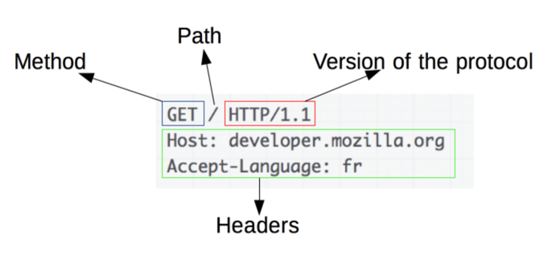

# HTTP vs HTTPS
## HTTP (HyperText Transfer Protiol)

- 서버/클라이언트 모델을 따라 데이터를 주고받기 위한 프로토콜이다.
- 1989년 팀 버너스 리에 의해 설계죄었으며 WWW(World Wide Web)기반에서 세계적인 정보를 공유하는데 큰 역할을 하였다.
- 인터넷에서 하이퍼텍스트를 교환하기 위한 통신규약으로 80번 포트를 사용하고 있다.
- 텍스트를 교환하기에 누군가 네트워크 신호를 가로채면 내용이 노출되는 보안 이슈가 존재한다. → 이를 해결해주는 것이 HTTPS이다.
- 애플리케이션 레벨의 프로토콜로 TCP/IP 위에서 작동한다.
- 상태를 갖고 있지 않은 Stateless 프로토콜이며 Method, Path, Version, Header, Body 등으로 구조가 구성되어 있다.

  

## HTTPS(HyperText Transfer Protocol Secure)

- HTTP에 인터넷 상에서 정보를 암호화하는 SSL 프로토콜을 사용해 데이터 암호화가 추가된 프로토콜이다.
- HTTP와 다르게 443포트를 사용하고 있다.
- HTTPS는 대칭키 암호화와 비대칭키 암호화를 모두 사용하여 빠른 연산 속도와 안정성을 모두 얻고 있다.
    - HTTPS 연결 과정(Hand-Shaking)에서 서버와 클라이언트간에 세션키를 교환한다. → 이때 세션키가 주고 받는 데이터를 암호화하기 위해 사용하는 대칭키이다.
    - 세션키를 클라이언트와 서버가 교환하기 위해 비대칭키를 사용한다.
- 오늘날에는 거의 차이를 못느낄 정도지만 암호화 복호화 과정이 필요하여 HTTP보다 속도가 느리다.

### HTTPS 동작 과정

1. 브라우저(클라이언트)가 서버로 최초 연결을 시도한다.
2. 서버는 인증서(공개키)를 브라우저에게 넘겨준다.
3. 브라우저는 인증서의 유효성을 검사하고 세션키를 발급한다.
4. 브라우저는 세션키를 보관하고 추가로 서버의 공개키로 세션키를 암호화하여 서버로 전송한다.
5. 서버는 개인키로 암호화된 세션키를 복호화하여 세션키를 얻는다.
6. 브라우저와 서버는 동일한 세션키를 공유함으로 데이터를 전달할 때 세션키로 암호화/복호화를 진행한다.

### HTTPS 의 발급 과정

서버는 클라이언트와 세션키를 공유하기 위한 공개키를 생성해야하는데, 일반적으로는 인증된 기관(CA, Certificate Authority)에 공개키를 전송하여 인증키를 받는다.

1. 애플리케이션 서버(A)를 만드는 기업은 HTTPS를 적용하기 위해 공개키와 개인키를 만든다.
2. 신뢰할 수 있는 CA 기업을 선택하고, 그 기업에게 내 공개키 관리를 부탁하며 계약을 한다.

   > ***CA란?*** : Certificate Authority로, 공개키를 저장해주는 신뢰성이 검증된 민간기업

3. 계약 완료된 CA 기업은 해당 기업의 이름, A서버 공개키, 공개키 암호화 방법을 담은 인증서를 만들고, 해당 인증서를 CA 기업의 개인키로 암호화해서 A서버에게 제공한다.
4. A서버는 암호화된 인증서를 갖게 되었다. 이제 A서버는 A서버의 공개키로 암호화된 HTTPS 요청이 아닌 요청이 오면, 이 암호화된 인증서를 클라이언트에게 건내준다.
5. 클라이언트가 `main.html` 파일을 달라고 A서버에 요청했다고 가정하자. HTTPS 요청이 아니기 때문에 CA기업이 A서버의 정보를 CA 기업의 개인키로 암호화한 인증서를 받게 된다.

   > CA 기업의 공개키는 브라우저가 이미 알고있다. (세계적으로 신뢰할 수 있는 기업으로 등록되어 있기 때문에, 브라우저가 인증서를 탐색하여 해독이 가능한 것)

6. 브라우저는 해독한 뒤 A서버의 공개키를 얻게 되었다. 이제 A서버와 통신할 대는 얻은 A서버의 공개키로 암호화해서 요청을 날리게 된다.

신뢰받는 CA 기업이 아닌 자체 인증서 발급한 경우 등의 상황에서는 HTTPS도 무조건 안전한 것은 아니다. 이때는 HTTPS지만 브라우저에서 `주의 요함`, `안전하지 않은 사이트`와 같은 알림으로 주의 받게 된다.

[[Web] HTTP와 HTTPS의 개념 및 차이점](https://mangkyu.tistory.com/98)
