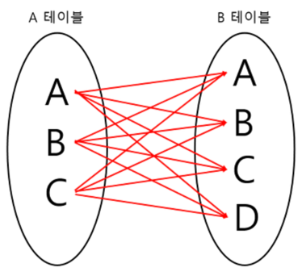

# Join
조인이란 두 개 이상의 테이블이나 데이터베이스를 연결하여 데이터를 검색하는 방법이다. 테이블을 연결하려면 1개 이상의 속성을 공유하고 있어야하여 이를 통해 데이터 검색을 한다.

## Join의 종류

- INNER JOIN
    - 기준 테이블과 조인 테이블의 중복된 교집합( A ∩ B )을 추출하게 된다.

    ```sql
    SELECT
    A.NAME, B.AGE
    FROM EX_TABLE A
    INNER JOIN JOIN_TABLE B ON A.NO_EMP = B.NO_EMP
    ```

- LEFT OUTER JOIN
    - 기준(왼쪽) 테이블과 조인 테이블의 교집합과 차집합의 연산 결과를 합친 것과 같다.

    ```sql
    SELECT
    A.NAME, B.AGE
    FROM EX_TABLE A
    LEFT OUTER JOIN JOIN_TABLE B ON A.NO_EMP = B.NO_EMP
    ```

- RIGHT OUTER JOIN
    - LEFT OUTER JOIN과 같으나 기준 테이블이 왼쪽에서 오른쪽으로 바뀐 것이다.

    ```sql
    SELECT
    A.NAME, B.AGE
    FROM EX_TABLE A
    RIGHT OUTER JOIN JOIN_TABLE B ON A.NO_EMP = B.NO_EMP
    ```

- FULL OUTER JOIN
    - 두 테이블의 합집합을 조회하게 된다.

    ```sql
    SELECT
    A.NAME, B.AGE
    FROM EX_TABLE A
    FULL OUTER JOIN JOIN_TABLE B ON A.NO_EMP = B.NO_EMP
    ```

- CROSS JOIN

  

    - 모든 경우의 수를 표현해주는 방식이다.

    ```sql
    SELECT
    A.NAME, B.AGE
    FROM EX_TABLE A
    CROSS JOIN JOIN_TABLE B
    ```

- SELF JOIN
    - 자기 자신과 조인하는 것으로 자신이 갖고 있는 컬럼을 다양하게 변형시켜 사용할 때 자주 사용한다.

    ```sql
    SELECT
    A.NAME, B.AGE
    FROM EX_TABLE A, EX_TABLE B
    ```
