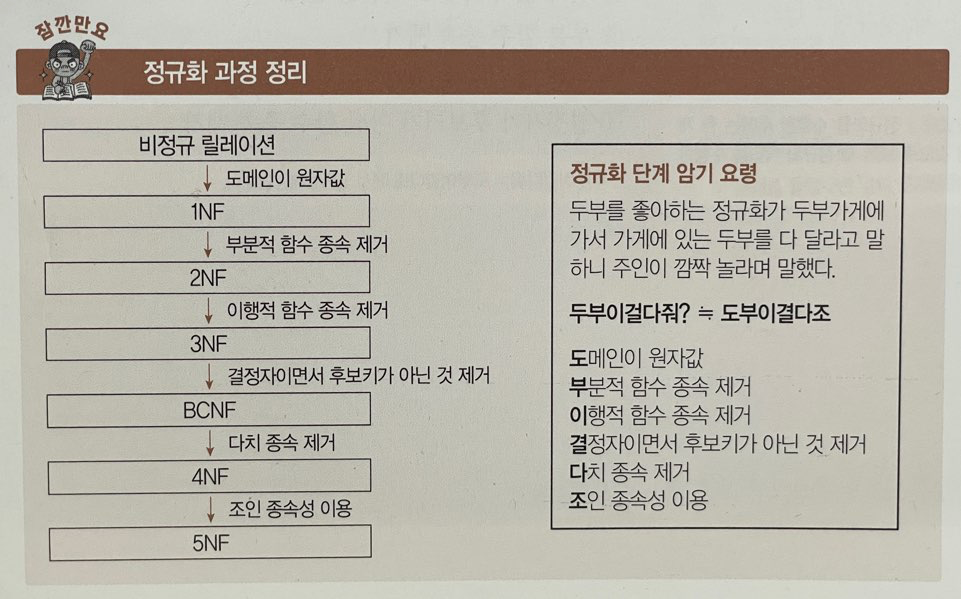

# 정규화(Normalization)
- 정규화란 잘못 설계된 관계형 스키마를 더 작은 속성의 세트로 쪼개어 바람직한 스키마로 만들어가는 과정이다.
- 데이터의 중복성을 최소화하고 일관성 등을 보장하여 데이터베이스의 품질을 보장하고 성능의 향상을 위해 수행한다.
- 정규화는 데이터베이스의 논리적 설계 단계에서 수행하며 논리적 처리 및 품질에 큰 영향을 미친다.
- 정규화 수준이 높을 수록 유연한 데이터 구축이 가능하고 데이터의 정확성이 높아지는 반면 물리적 접근이 복잡하고 너무 많은 조인으로 인해 조회 성능이 저하된다.

## 정규화의 목적

- 데이터 구조의 안정성 및 **무결성을 유지**한다.
- **데이터 중복을 배제**하여 **이상(Anomaly)의 발생 방지** 및 **자료 저장 공간의 최소화**가 가능하다
- 테이블의 구성을 논리적이고 직관적으로 할 수 있다.
- 어떤 릴레이션이라도 데이터베이스 내에서 표현 가능하게 만든다
- 효과적인 검색 알고리즘을 생성할 수 있다.
- 데이터 삽입시 릴레이션을 재구성할 필요성을 줄인다.
- 속성의 배열 상태 검증이 가능하다
- 개체와 속성의 누락 여부 확인이 가능하다
- 자료 검색과 추출의 효율성을 추구한다.

## 정규화 과정

정규화에는 여러가지 단계가 있지만, 대체적으로 1~3단계 정규화까지의 과정을 거친다.

### 1NF

- 릴레이션에 속한 **모든 도메인이 원자 값(Atomic Value, 하나의 값)**으로만 되어 있는 정규형이다. 즉, 릴레이션의 모든 속성 값이 원자 값으로만 되어 있는 정규형이다.
- 아래의 조건을 만족해야한다.
    - 어떤 릴레이션에 속한 모든 도메인이 원자값만으로 되어 있어야한다.
    - 모든 속성에 반복되는 그룹이 나타나지 않는다.
    - 기본키를 사용하여 관련 데이터의 각 집합을 고유하게 식별할 수 있어야 한다.

### 2NF

- 제1정규화를 진행한 테이블에 대해 **기본키가 아닌 모든 속성이 기본키에 대하여 완전 함수적 종속을 만족**하도록 테이블을 분해하는 것이다.

  > 완전 함수적 종속??
  기본키의 부분집합이 결정자가 되어서는 안된다는 것을 의미한다.
>
- 즉, 테이블에서 기본키가 복합키(키1, 키2)로 묶여있을 때, 두 키 중 하나의 키만으로 다른 컬럼을 결정지을 수 있으면 안된다는 뜻이다.

### 3NF

- 제2정규화를 진행한 테이블에 대해 기본키가 아닌 **모든 속성이 기본키에 대해 이행적 종석을 만족하지 않도록** 테이블을 분해하는 것이다.

  > 이행적 함수 종속은 A→B, B→C이면 A→C가 성립되는 것을 의미한다.
>

### BCNF (Boyce-Codd 정규형)

- 제3정규화를 진행한 테이블에 대해 **결정자가 모두 후보키**가 되도록 테이블을 분해하는 것이다.

  > 결정자는 속성간의 종속성을 규명할 때 기준이 되는 값을 의미한다.
>
- 3NF에서 후보키가 여러 개 존재하고 서로 중첩되는 경우에 적용하는 강한 3 정규형이라고도 한다.
- 제약조건
    - 키가 아닌 모든 속성은 각 키에 대하여 완전 종속해야 한다.
    - 키가 아닌 모든 속성은 그 자신이 부분적으로 들어가 있지 않은 모든 키에 대하여 완전 종속해야 한다.
    - 어떤 속성도 키가 아닌 속성에 대해서는 완전 종속할 수 없다.

### 4NF

**다치 종속 A→B가 성립하는 경우 릴레이션의 모든 속성이 A에 함수적 종속 관계를 만족**하는 정규형이다.

> 다치종속이란?
A,B,C 3개의 속성을 가진 릴레이션에서 어떤 복합 속성(A,C)에 대응하는 B값의 집합이 A값에만 종속되고 C값에는 무관하면 B는 A에 다치 종속이라고 한다.
>

### 5NF

모든 **조인 종속이 릴레이션의 후보키를 통해서만 성립**되는 정규형이다.

## 암기

두부이걸 다줘?? == 도부이결다조

