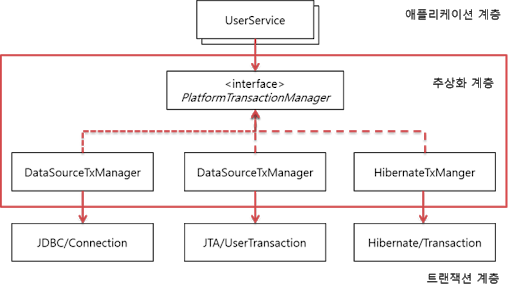

# 스프링 트랜잭션
# 스프링 트랜잭션의 3가지 핵심 기술

스프링은 트랜잭션과 관련된 3가지 핵심 기술을 제공하고 있다.

1. 트랜잭션 동기화
2. 트랜잭션 추상화
3. AOP를 이용한 트랜잭션 분리

## 트랜잭션 동기화

Spring JDBC가 아닌 Java에서 제공하는 JDBC를 통해 개발을 한다면 트랜잭션으로 작업을 관리하기 위해 Connection 객체를 공유하는 등의 불필요한 작업들이 많이 발생한다. 스프링은 이러한 불필요한 작업들을 해결해보고자 트랜잭션을 시작하기 위한 **Connection객체를 특별한 저장소에 보관해두고 필요할 때 꺼내쓸 수 있도록 하는 트랜잭션 동기화 기술을 제공**하고 있다. 트랜잭션 동기화는 작업 쓰레드마다 Connection객체를 독립적으로 관리하기에 멀티 쓰레드 환경에서도 충돌이 발생할 여지가 없다.

## 트랜잭션 추상화

개발자가 JDBC가 아닌 Hibernate와 같은 기술을 쓴다면 JDBC에 종속적인 트랜잭션 동기화 코드들은 다른 문제들을 유발하게 된다. 대표적으로는 Hibernate에서 Connection이 아닌 Session객체를 사용하는 차이가 있다. 이와 같이 기술에 종속적인 문제들을 해결하기 위해 스프링에서는 트랜잭션 추상화 기술을 제공하고 있다.

스프링은 **트랜잭션 기술의 공통점을 담은 추상화 기술을 제공하고 있어 애플리케이션에 기술의 종속적인 코드를 이용하지 않고도 일관되게 트랜잭션을 처리할 수 있다.**

스프링에서는  `PlatformTransactionManager` 인터페이스를 제공하여 개발자는 사용하는 기술과 무관하게 해당 인터페이스를 통해 트랜잭션을 공유, 커밋, 롤백할 수 있다.

## AOP를 이용한 트랜잭션 분리

기존 트랜잭션을 적용한 비즈니스 코드들에는 트랜잭션 코드와 비즈니스 코드가 결합되어 2가지 책임을 갖고 있었다. 스프링에서는 이러한 **책임을 분리하고자 AOP를 적용하여 트랜잭션 로직들을 트랜잭션 어노테이션(**`@Transactional`**)을 붙이면 자동으로 적용되도록 하였다.** 덕분에 비즈니스 코드와 트랜잭션 코드가 분리가 되었다.

# 트랜잭션의 세부 설정들

## Propagation

트랜잭션의 경계에서 이미 진행중인 트랜잭션이 있거나 없을 때 어떻게 동작할 것인가를 결정하는 방식을 의미한다. 스프링이 제공하는 선언적 트랜잭션(어노테이션을 통한 트랜잭션 선언)의 장점 중 하나는 여러 트랜잭션 적용 범위를 묶어서 커다란 하나의 트랜잭션 경계를 만들 수 있다는 점이다. 개발자들은 `@Transactional`의 propagation 속성을 통해 트랜잭션의 전파 여부를 결정할 수 있다.

- REQUIRED
    - Default 속성으로 모든 트랜잭션 매니저가 지원한다.
    - 미리 시작된 트랜잭션이 있으면 참여하고 없으면 새로 시작한다. 즉, 하나의 트랜잭션이 실행 후 다른 트랜잭션이 설정된 메서드가 호출되면 같은 트랜잭션으로 묶인다.
- SUPPORTS
    - 미리 시작된 트랜잭션이 있으면 참가하고 그렇지 않으면 트랜잭션 없이 진행한다.
    - 트랜잭션이 없어도 경계 안에서 Connection객체나 Hibernate의 Session 등은 공유할 수 있다.
- MANDATORY
    - 이미 시작된 트랜잭션이 있으면 참가하고 없으면 새로 시작하는 대신 예외를 발생시킨다.
    - 혼자서 독맂벅으로 트랜잭션을 진행하면 안되는 경우에 사용한다.
- REQUIRES_NEW
    - 이미 진행중인 트랜잭션이 있으면 이를 보류하고 새로운 트랜잭션을 만들어 시작한다.
    - 항상 새로운 트랜잭션을 사용해야하는 경우에 사용한다.
- NOT_SUPPORTED
    - 이미 진행중인 트랜잭션이 있으면 이를 보류하고 트랜잭션을 사용하지 않도록 한다.
- NEVER
    - 이미 진행중인 트랜잭션이 있으면 예외를 발생시켜 트랜잭션을 사용하지 않도록 강제한다.
- NESTED
    - 이미 진행중인 트랜잭션이 있으면 트랜잭션 안에 자식 트랜잭션을 만들어 시작한다.
    - 부모 트랜잭션의 커밋과 롤백에는 자식이 영향을 받지만 자식의 커밋과 롤백은 부모 트랜잭션에게 영향을 주지 않는다.

## Isolation

DefaultTransactionDefinition에 설정된 격리수준은 ISOLATION_DEFAULT로 DataSource에 정의된 격리 수준을 따르고 있다. 기본적으로는 DB나 DataSource에 설정된 기본 격리 수준을 따르는 것이 좋지만, 특별한 작업을 수행하는 메소드라면 독자적으로 지정해줄 필요가 있다.

- DEFAULT
    - Data Access기술 또는 DB Driver의 Default 설정을 따른다.
    - 대부분의 DB들은 READ_COMMITED를 기본 격리수준으로 가진다. (드라이버와 DB문서를 참고해서 기본 격리 수준을 확인해야 한다.)
- READ_UNCOMMITTED
    - 하나의 트랜잭션이 커밋되기 전에 변화가 다른 트랜잭션에 노출될 수 있다.
    - 일관성이 떨어지더라도 성능을 극대화할 때 의도적으로 사용한다.
- READ_COMMITTED
    - 스프링의 기본 속성이다.
    - 다른 트랜잭션이 커밋하지 않은 정보는 읽을 수 없다.
    - 하나의 트랜잭션이 읽은 데이터를 다른 트랜잭션이 수정할 수는 있다. → 이러한 이유 때문에 하나의 트랜잭션이 같은 데이터를 읽을 때 다른 내용이 나올 수 있다.
- REPEATABLE_READ
    - 하나의 트랜잭션이 읽은 데이터를 다른 트랜잭션이 수정할 수 없도록 막아준다.
    - 새로 데이터를 추가하는 것은 막지 않아 SELECT로 조회를 할 때 트랜잭션이 끝나기 전에 기존에 없던 데이터가 발견될 수 있다.
- SERIALIZABLE
    - 가장 강력한 트랜잭션 격리 수준으로 트랜잭션을 순차적으로 진행시켜준다.
    - 성능이 가장 떨어져서 극단적으로 안전한 작업이 필요한 경우가 아니면 사용하지 않는다.

## timeout(제한 시간)

트랜잭션을 수행하는 제한 시간을 설정할 수 있다. 별도 설정이 없는 경우 트랜잭션 시스템의 제한시간을 따르고 제한 시간을 지정하였는데 핻강 기능을 지원하지 못하면 예외가 발생할 수 있다.

## readOnly

읽기 전용으로 설정해두면 트랜잭션 내에서 데이터를 조작할 수 있는 일을 막을 수 있다. 또한 기술에 따라 성능이 향상될 수 있다고 한다.

> 클래스단에서 Default로 `@Transactional(readOnly = true)`를 설정한 후 데이터를 조작해야하는 메서드에 `@Transactional`를 붙여 데이터를 조작하는 것이 좋다.
>

# Reference
- [[Spring] 트랜잭션에 대한 이해와 Spring이 제공하는 Transaction(트랜잭션) 핵심 기술 - (1/3)](https://mangkyu.tistory.com/154)
- [[Spring] Spring 트랜잭션의 세부 설정(전파 속성, 격리수준, 읽기전용, 롤백/커밋 예외 등) - (2/3)](https://mangkyu.tistory.com/169)
- [[10분 테코톡] 후니의 스프링 트랜잭션](https://www.youtube.com/watch?v=cc4M-GS9DoY)
