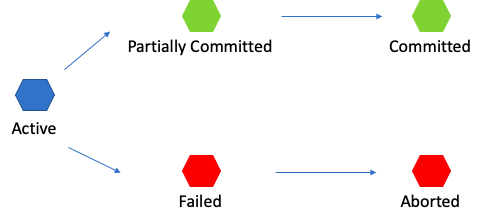

트랜잭션(Transaction)이란 데이터베이스의 상태를 변화시키기 위해 수행하는 작업 단위이다. 여기서 데이터베이스의 상태를 변화시킨다는 것은 아래의 SQL 질의어를 통해 데이터베이스에 접근하는 것을 의미한다.

- SELECT
- INSERT
- UPDATE
- DELETE

여기서 중요한 것은 트랜잭션은 하나의 질의어가 아니라 개발자가 정하는 기준에 따라 여러개의 질의어가 될 수 있다.

# 트랜잭션의 특징

트랜잭션의 특징은 흔히 ACID로 알려진 특징이 있다.

- Atomicity (원자성)
  - 트랜잭션은 DB에 반영되거나 전혀 반영되지 않아야 한다.
- Consistency (일관성)
  - 트랜잭션의 작업 처리 결과는 항상 일관성이 있어야 한다.
  - 시스템이 가지고 있는 고정요소는 트랜잭션 수행 전과 후의 상태가 같아야 한다.
- Isolation (독립성)
  - 둘 이상의 트랜잭션이 동시에 수행되고 있을 때, 어떠한 트랜잭션도 다른 트랜잭션 연산에 끼어들 수 없다.
  - 즉, 각각의 트랜잭션은 독립적이라 서로 간섭이 불가능하다.
- Durability (지속성)
  - 트랜잭션이 성공적으로 완료되면 그 결과는 영구적으로 반영되어야 한다.

# 트랜잭션 연산

- Commit
  - Commit은 하나의 트랜잭션의 작업이 성공적으로 끝났고 데이터베이스가 다시 일관된 상태에 있을 때, 해당 트랜잭션의 갱신 연산이 완료됐다는 것을 알려주는 연산이다.
- Rollback
  - 하나의 트랜잭션 처리가 비정상적으로 종료되어 트랜잭션의 원자성이 깨진 경우, 트랜잭션을 처음부터 다시 시작하거나 트랜잭션의 부분적으로만 연산된 결과를 다시 취소시킨다.

# 트랜잭션의 상태

트랜잭션은 논리적으로 아래의 5가지 상태에 있을 수 있다.

- Active: 현재 실행중인 상태
- Failed: 실행중에 오류가 발생해 중단된 상태
- Aborted: 비정상 종료되어 Rollback이 수행된 상태
- Partially Committed: 연산이 마지막까지 실행되고 Commit되기 직전 상태
- Committed: 성공적으로 종료되어 Commit연산을 실행한 후의 상태

# 트랜잭션의 격리 수준 (Isolation Level)

트랜잭션의 격리 수준이란 트랜잭션간의 일관성 없는 데이터를 허용하도록 하는 수준을 의미한다. 트랜잭션 간의 일관성이 같으면 무조건 좋다고 생각할 수 있다. 하지만 이것은 잘못된 생각이다. 모든 트랜잭션간의 일관성을 맞추려면 하나의 트랜잭션이 DB에 접근할 때 다른 트랜잭션이 접근하지 못하도록 Lock을 걸어둬야 할 것이다. 하지만 처럼 모든 트랜잭션에대해 Lock을 걸어 트랜잭션들이 순차적으로 수행된다면 데이터베이스의 성능이 현저히 떨어질 것이다.

그렇다고 Lock을 걸지 않게 된다면 데이터의 일관성이 깨져서 잘못된 값으로 처리될 문제가 발생하기에 적절한 격리 수준을 설정하여야 한다.

# Isolation Level의 종류

격리 수준은 아래의 4가지 수준이 존재한다. 지금부터 하나씩 살펴보겠다.

1. **Level 0** Read Uncommitted
2. **Level 1** Read Committed
3. **Level 2** Repeatable Read
4. **Level 3** Serializable

## Level 0. Read Uncommitted

트랜잭션이 처리중이거나 아직 Commit되지 않은 데이터를 다른 트랜잭션이 읽는 것을 허용한다. 그렇기게 데이터베이스 결과의 일관성을 유지하기 힘들다는 단점이 존재하나 동시성은 향상된다.

> 트랜잭션 1 이 수행 중에 트랜잭션 2 가 값을 변경할 수 있는데, 트랜잭션1은 변경되기 전의 값을 읽기 때문에 최대한 사용하지 않아야 한다. 이를 Dirty Read 라고 한다.
>

### 발생될 수 있는 이상 현상

- Dirty Read: Uncommitted 결과를 확인하는 현상
- Non Repeatable Read : 한 트랜잭션에서 동일한 쿼리를 2번 실행할 때 그 사이에 **다른 트랜잭션값을 수정 또는 삭제하며 두 쿼리의 결과가 이상하게 나타나 일관성이 깨지는 현상**
- Phantom Read : 한 트랜잭션 안에서 일정 범위의 레코드를 두 번 이상 읽었을 때, 첫번째 쿼리에서 없던 레코드가 두번째 쿼리에서 나타나는 현상

## Level 1. Read Committed

트랜잭션이 작업하는 시점에 Lock을 건다. 그렇기에 트랜잭션이 수행되는 동안 다른 트랜잭션이 접근을 할 수 없어 대기 상태에 빠지고 Commit된 트랜잭션만 조회가 가능하다. 해당 격리 Level은 대부분의 DBMS가 Default로 사용하고 있다. 하지만 MySQL은 해당되지 않는다.

> INSERT, UPDATE, DELETE와 같은 작업 세션들이 Lock을 걸고 SELECT 세션은 대기를 한다.
>

### 발생될 수 있는 이상 현상

- Non Repeatable Read : 한 트랜잭션에서 동일한 쿼리를 2번 실행할 때 그 사이에 **다른 트랜잭션값을 수정 또는 삭제하며 두 쿼리의 결과가 이상하게 나타나 일관성이 깨지는 현상**
- Phantom Read : 한 트랜잭션 안에서 일정 범위의 레코드를 두 번 이상 읽었을 때, 첫번째 쿼리에서 없던 레코드가 두번째 쿼리에서 나타나는 현상

## Level 2. Repeatable Read

Read Committed와 마찬가지로 트랜잭션이 작업하는 시간에 Lock을 건다. 하지만 Lock을 거는 주체가 다르다.

> SELECT 쿼리 세션이 Lock을 걸고 UPDATE, INSERT, DELETE와 같은 작업 세션이 대기를 한다.
>

MySQL에서 사용하는 Default 격리 수준이다.

### 발생될 수 있는 이상 현상

- Phantom Read : 한 트랜잭션 안에서 일정 범위의 레코드를 두 번 이상 읽었을 때, 첫번째 쿼리에서 없던 레코드가 두번째 쿼리에서 나타나는 현상

## Level 3. Serializable

모든 동작이 직렬화하게 작동하여 완벽한 읽기 일관성 모드를 제공한다. 다른 사용자들은 트랜잭션 영역에 해당되는 데이터에 대한 수정 및 입력이 불가능하다. 하지만 해당 격리 수준은 데이터의 안정성이 매우 중요한 특수한 상황이 아니면 거의 사용하지 않는다.

# Reference 
- [[데이터베이스] Transaction, 트랜잭션이란?](https://wonit.tistory.com/462)
- [[데이터베이스] Isolation Level, 고립 수준](https://wonit.tistory.com/463?category=790502)
- [트랜잭션 격리 수준(Transaction Isolation Level)](https://gyoogle.dev/blog/computer-science/data-base/Transaction%20Isolation%20Level.html)
