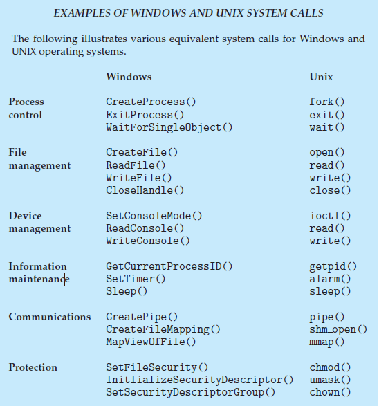

# System Call

> 사용자 모드에서 커널 영역의 기능을 사용할 수 있도록 해주는 인터페이스

## 종류

- Process Control
  - 프로세스 생성, 종료
  - 메모리에 로드, 실행
  - 프로세서 속성 값 확인, 지정
  - wait, signal
  - 메모리 할당
- File Management
  - 파일 CRUD
  - 속성 값 확인, 지정
- Device Management
  - 디바이스 요청 및 해제
  - 속성 값 확인, 지정
  - 비 물리적 디바이스 해제 및 장착
- Information maintenance
  - 시간 확인, 시간 지정
  - 시스템 데이터 확인, 자정
  - 프로세스, 파일, 디바이스 속성 확인 및 설정
- Communications
  - 커뮤니케이션 연결 생성, 삭제
  - 메시지 송신, 수신
  - 상태 정보 전달
  - 원격 장치 해제 및 장착
- Protection
  - Permission 획득, 설정

### references

- [[운영체제] 시스템 콜 (System Call) (tistory.com)](https://fjvbn2003.tistory.com/306)
