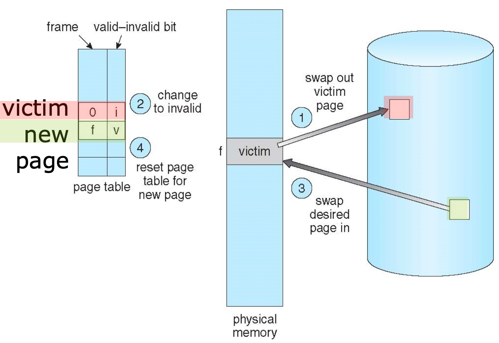
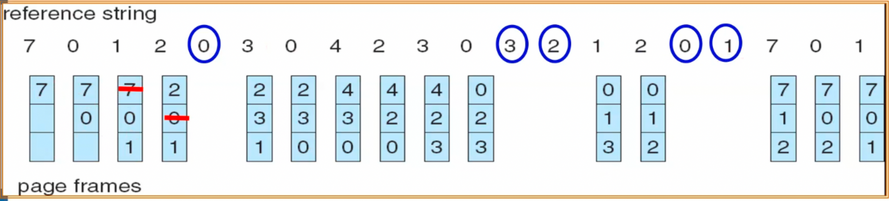
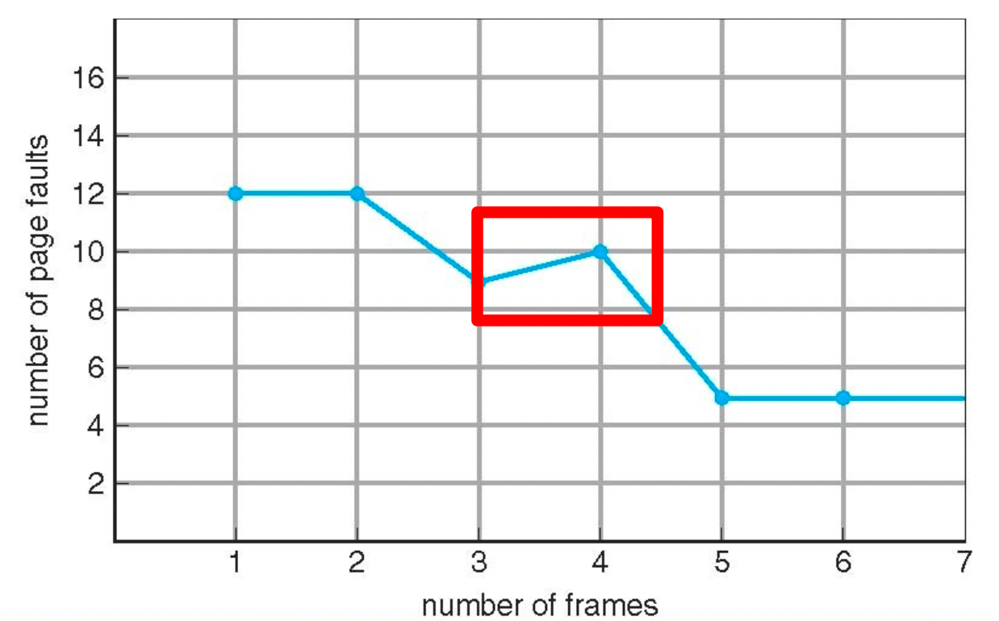
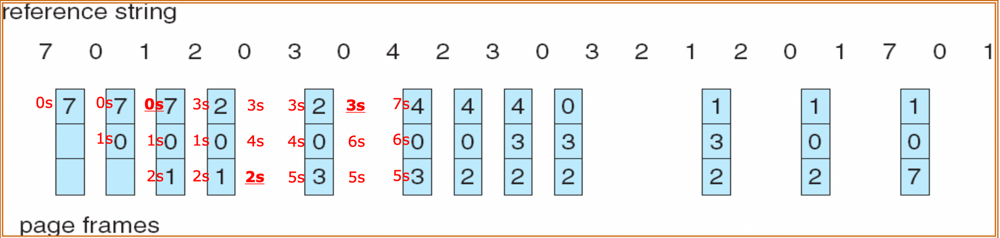

# Page Replacement Algorithm
Main memory는 컴퓨터 내에서 값비싼 자원이라 모든 프로세스의 정보들을 올리는데에는 부담이 있다. 이를 위해 Swapping, Deman Paging과 같은 기법들이 나왔으나 그럼에도 불구하고 결국 메모리는 가득차게 된다. 메모리가 가득차게 된다면 필요한 페이지를 메인 메모리로 가져오기 위해서는 불필요한 페이지를 내보내고 필요한 페이지를 가져오는 작업이 필요하다. 이때 어떠한 페이지를 내보낼지 정해하는 방법이 바로 페이지 교체 알고리즘이다.

> Swapping
>
> - Physical memory의 공간이 부족할 경우가 존재하여 swap memory를 사용한다.
> - process전제를 swap in/out시키는 방법을 swapping이라고 한다.
> - swapping은 많은 시간이 걸리고 낭비가 심해서 사용하지 않고 실제로는 demand paging을 사용한다.

> Demand Paging
>
> - process전체를 swap in/out시키는게 아니라 일부만 하는 기법이다.
    >     - 메인 메모리에 올리지 않는 데이터들은 Swap space에 올라가게 된다.
> - Program을 실행시키기 위해 disk에서 main memory로 올리는 방법은 program 전체를 올리는 방법과 필요에 따라 필요한 page만 load하는 방법이 있다.
> - Demand paging은 Error code, unusual routines, large data structure 등을 main memory에 올리는 것은 낭비라 필요한 일부만 올린다.
> - 장점
    >     - 메모리에서 읽어오는 I/O 작업이 줄어들어 프로그램의 로딩과 응답이 빠르다.
>     - 메모리의 공간을 조금만 사용하여서 더 많은 프로그램을 올릴 수 있다.

## 페이지 교체의 전반적인 순서

1. disk에서 Page가 있는 위치를 찾는다.
2. Free frame을 찾는다. (free frame이 있다면 그 frame을 주고 없다면 page replacement algorithm에 의해 victim frame을 선택하여 page replacement를 한다.)
3. 1에서 찾은 원해는 page를 읽고 free frame에 넣어주고 Page/frame table을 업데이트해준다.
4. Restart the process

## Page Replacement Algorithm 종류

### FIFO Algorithm

- 가장 오래된 page가 먼저 victim page가 되어 page out이 된다.

  > Victim page는 페이지 아웃 될 페이지를 의미한다.
>
- FIFO 알고리즘에서는 frame의 수가 증가하여도 page fault가 늘어나는 **Belady’s anomaly** 현상이 발생하기도 한다.

  > **Belady’s anomaly란?**
  >
  >
  > 일반적으로 할당된 frame이 많아질 수록 메모리에 올라간 페이지가 많아 Page fault가 줄어든다. 하지만 FIFO의 경우 old page가 자주 이용되는 page인 상황이 발생할 수 있어서 프레임이 많아져도 Page fault가 더 많이 발생하는 belady’s 현상이 발생할 수 있다.
  >
  > 
>

### Optimal Algorithm

- 가장 오랫동안 사용하지 않을 page를 replacement시켜서 page fault rate이 가장 작은 알고리즘이다.
- 미래에 어떤 page를 사용할지 모두 알 수가 없기에 실제로 사용하기는 어렵다. (미래를 다 알고 있다는 가정으로 하는 것이다.)
- 실제 사용하기는 어려워 새로운 algorithm을 평가할 때 비교 대상으로 사용

### LRU(Least Recently Used) Algorighm

- 가장 오랫동안 사용하지 않은 것을 victim page로 선정한다.
- 일반적으로 가장 자주 이용된다.
- Counter를 사용하여 사용된 이후의 지난 시간을 측정한다.

  > Counter란?
  >
  > - 모든 page entry마다 갖고 counter를 갖고 있으며 page가 참조될 때마다 counter를 업데이트한다.
  > - Page가 추가로 필요할 때는 counter값이 가장 작은 것을 victim page로 선정한다
- Stack을 이용하기도 한다. 가장 사용하는 것을 맨 위로 올리고 가장 아래 있는 것을 replacement시키는 방식
- Counter, stack은 overhead가 크게 발생하여 특수한 hardware인 reference bit을 이용한다.

  > Reference bit
  >
  > - counter처럼 정확하게 측정하는게 아니고 근사치를 통해 변경하는 방법이다.
  > - page들마다 존재하며 초기값은 0이다.
  > - Page가 참조되면 1로 변경한다.
  > - 정확한 순서는 모르지만 최근에 참조한지 안한지만 알 수 있으며 reference bit이 0인 아무 page를 replacement한다. (0은 최근에 참조한 적이 없는것이고 1은 참조한 적이 있는 것이다.)
